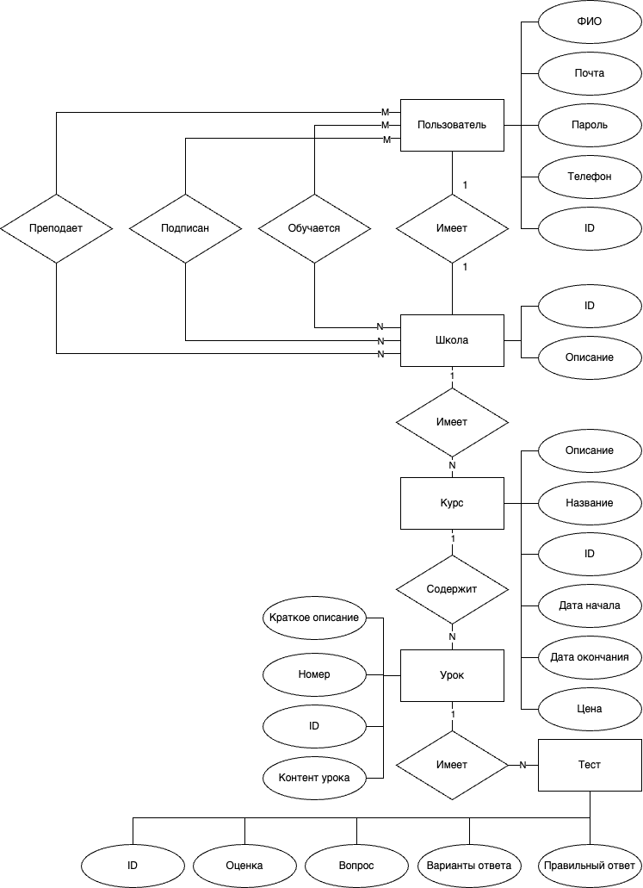

# Eschool

## Краткое описание идеи проекта
Сайт для онлайн образования с возможностью создания собственных учебных программ или курсов.

Предоставить каждому пользователю возможность покупать и проходить курсы различной тематики. 
Также у каждого пользователя должна быть возможность создать собственную школу и образовательную программу 
или присоединиться к уже существующей школе в качестве преподавателя или составителя курса.

По прохождении курса пользователь должен иметь возможность получить сертификат о завершении обучения, 
включающий подробное описание его успеваемости и итоговую оценку.

## Описание предметной области

Предметная область - онлайн образование.

Онлайн обучение - образовательный процесс с применением совокупности телекоммуникационных технологий, 
имеющих целью предоставление возможности обучаемым освоить основной объём требуемой им 
информации без непосредственного контакта обучаемых и преподавателей в ходе процесса обучения.

Школа в данном проекте включает в себя множество преподавателей, студентов и курсов, которые могут быть реализованы
преподавателями данной школы. Также школа содержит дополнительную информацию о создателе, платежные данные
для оплаты того или иного курса и т. д.

Онлайн школа предоставляет возможность получать как теоретические знания, так и практические. 
Каждый курс разбит на уроки, которые могут быть нескольких типов: текстовые, видео-уроки и практические.
Текстовые и видео уроки предоставляют теоретические знания, в то время как практические задания 
представлены в виде тестов с множественным выбором. За прохождение какого-либо урока, студенту начисляются 
баллы за прохождение курса.

## Анализ аналогичных решений по 3 критериям

| Решение          | Подробный отчет об обучении | Наличие теории и практики | Понятный интерфейс |
|------------------|-----------------------------|---------------------------|--------------------|
| Eschool          | +                           | +                         | +                  |
| Stepik           | -                           | +                         | -                  |
| Coursera         | +                           | +                         | -                  |
| Yandex practicum | -                           | -                         | +                  |

## Актуальность

Онлайн образовательные платформы для создания курсов являются актуальными, 
предоставляя современным обучающимся возможность получить качественное образование, 
а преподавателям – эффективный инструмент для создания и распространения образовательного контента.

Онлайн обучение позволяет избежать затрат на поездки, проживание и другие расходы, связанные 
с традиционными формами образования. Это делает обучение более доступным и экономически эффективным.
Онлайн платформы позволяют преодолеть географические и социальные барьеры, 
предоставляя возможность обучаться из любой точки мира.

## Описание ролей
**Гость** - неавторизованный пользователь, который может посмотривать информацию о курсе, 
авторизоваться, зарегистрироваться

**Студент** - авторизованный, может посмотреть курсы, проходить, оплачивать их, 
по завершении курса получать сертификат/отчет об успеваемости и оставлять отзывы, 
а также стать преподавателем.

**Преподаватель** - авторизованный, может создать собственную школу и курсы в ней, 
а также присоединиться к существующей школе в качестве ментора/преподавателя, имеет отзывы о созданных курсах.

## Use-Case диаграмма

## ER диаграмма

## Сложные сценарии

#### Формирование сертификата о пройденном курсе

* Каждый урок в курсе имеет максимальный балл, устанавливаемый преподавателем. 
* Ограничений на кол-во баллов нет, так как итоговая оценка будет рассчитана по процентному соотношению.
* У каждого курса есть сложность, которая выражается по шкале от 1 до 5 (от новичка до профессионала).
* При расчете общей оценки курса, каждый полученный балл за урок умножается на уровень курса. 
* Если кол-во пройденных тестов меньше половины, то курс считается незавершенным 
и необходимо пройти практические задания. 
* Сертификат имеет статусы:
  - Бронзовый - набрано более 50% баллов от максимально возможного кол-ва;
  - Серебряный - набрано более 70% баллов от максимально возможного кол-ва;
  - Золотой - набрано более 90% баллов от максимально возможного кол-ва.

Процесс формирования сертификата:
1.  проверяется, что курс начат и окончен в поставленные сроки;
2.  рассчитываются количества баллов за тесты Pi, где i - номер теста;
3.  рассчитываются количества баллов за теоретические уроки Tj, где j - номер теор. урока;
4.  проверяется что (P1 +...+ PN) и (T1 +...+TM) больше половины от кол-ва тестов и теор. блоков в курсе соответственно.
5.  к Pi и Tj применяется коэффициент сложности курса D, от 1 до 5;
6.  рассчитывается максимально возможная оценка за курса по формуле: Nmax = ((P1max +...+PNmax) + (T1max +...+TMmax)) * D;
7.  рассчитывается реальная оценка студента: Nreal = ((P1 +...+ PN) + (T1 +...+TM)) * D;
8.  формируется статус сертификата в зависимости от процентного отношения Nreal к Nmax;
9.  итоговая оценка Nreal переводится в шкалу от 1 до 100 баллов;
10. фиксируется время начала и окончания курса;
11. формируется страница с сертификатом студента.

#### Создание и публикация курса

Теоретические уроки курса будут выполнены в виде Markdown страниц, 
практические уроки в виде набора тестов с множественным выбором.
При этом каждый тест содержит максимальную оценку за его решение.

Курс считается правильно созданным, если:
* имеет хотя бы один теоретический урок (текстовый или видео);
* имеет хотя бы один практический урок, состоящий из хотя бы одного теста;
* уроки курса имеют не нулевую максимальную оценку;
* текстовые уроки содержат не пустой markdown файл;
* видео уроки содержат ссылку на видео;
* дата начала и дата окончания курса отличаются хотя бы на 1 день;

Процесс создания и публикации курса:
1. Преподаватель формирует контент курса и соответствующие уроки;
2. Курс находится в состоянии черновика;
3. По завершении работы, курс проверяется на корректность по выше описанным правилам;
4. В случае успешной валидации курс переходит в состояние готовности к публикации;
5. При запросе преподавателя на публикацию становится видимым другим пользователям и переходит в состояние "опубликован".

#### Аутентификация пользователей при входе
1. Пользователь вводит логин и пароль;
2. Проводится идентификация пользователся по переданным данным;
3. Создается пара JWT токенов - access токен и refresh токен;
4. Создается новая сессия;
5. Сессия помещается в хранилище сессий;
6. Пользователю возвращется access и refresh токены.

## Пользовательские сценарии

**Гость** может:
- просмотривать информацию о курсах;
- пройти аутентификацию (ввести логин и пароль учетной записи);
- зарегистрироваться.

После авторизации гость становится студентом, то есть авторизованным пользователем системы.

**Студент** может:
- просмотривать информацию о курсах;
- покупать курсы и проходить их;
- по прохождении курса получать сертификат с подробным описанием успеваемости;
- стать преподавателем в существующей школе или основать свою школу;
- оставлять отзывы о пройденных курсах.

После заявки на становление преподавателем.

**Преподаватель** может:
- составить свой курс;
- редактировать/модерировать существующий курс в другой школе;
- просматривать статистику об успеваемости студентов собственного курса.

## BPMN-диаграмма

## Диаграмма БД

## Описание технологического стека
- Язык - Golang
- Тип UI - Web SPA (фреймворк React с TypeScript)
- Тип приложения - Web API
- База данных - PostreSQL
- Хранилище сессий - Redis
- Объектное хранилище - S3 MinIO
- Платежная система - YooMoney
- Аутентификация - JWT токены

## Верхнеуровневое разбиение на компоненты

## UML диаграммы классов

## Экраны будущего web-приложения

