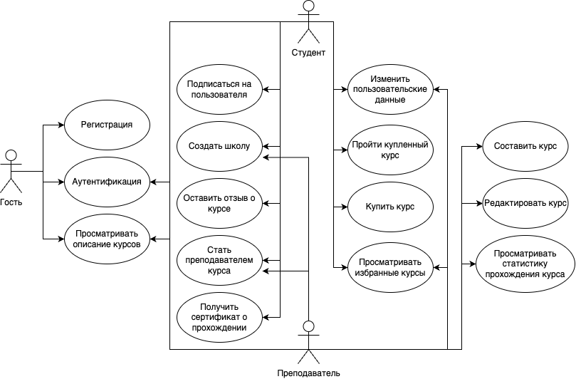
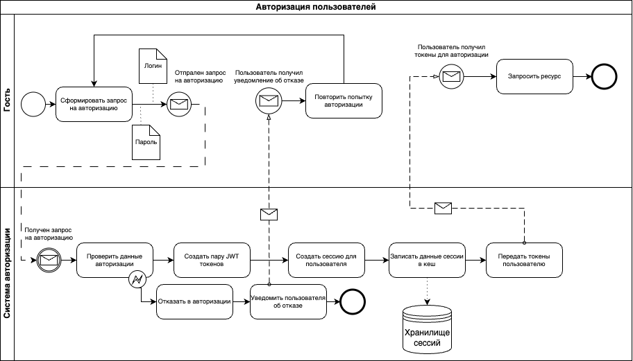

# ППО

## Название проекта
Eschool

## Краткое описание идеи проекта
Сайт для онлайн образования с возможностью создания собственных учебных программ или курсов.

Предоставить каждому пользователю возможность покупать и проходить курсы различной тематики. 
Также у каждого пользователя должна быть возможность создать собственную школу и образовательную программу 
или присоединиться к уже существующей школе в качестве преподавателя или составителя курса.

По прохождению курса пользователь должен иметь возможность получить сертификат о прохождении обучения, 
включающий подробное описание его успеваемости и итоговую оценку.

## Краткое описание предметной области

Предметная область - онлайн образование.

Онлайн обучение - образовательный процесс с применением совокупности телекоммуникационных технологий, 
имеющих целью предоставление возможности обучаемым освоить основной объём требуемой им 
информации без непосредственного контакта обучаемых и преподавателей в ходе процесса обучения.

Онлайн школа предоставляет возможность получать как теоретические знания, так и практические 
путем прохождения тестирования после завершения урока. В рамках школы могут быть реализованы нескольких курсов. 

## Анализ аналогичных решений по 3 критериям

| Решение          | Подробный отчет об обучении | Наличие теории и практики | Нагруженный интерфейс |
|------------------|-----------------------------|---------------------------|-----------------------|
| Eschool          | +                           | +                         | -                     |
| Stepik           | -                           | +                         | +                     |
| Coursera         | +                           | +                         | +                     |
| Yandex practicum | -                           | -                         | -                     |

## Актуальность

Онлайн образовательные платформы для создания курсов являются актуальными, 
предоставляя современным обучающимся возможность получить качественное образование, 
а преподавателям – эффективный инструмент для создания и распространения образовательного контента.

Онлайн обучение позволяет избежать затрат на поездки, проживание и другие расходы, связанные 
с традиционными формами образования. Это делает обучение более доступным и экономически эффективным.
Онлайн платформы позволяют преодолеть географические и социальные барьеры, 
предоставляя возможность обучаться из любой точки мира.

## Описание ролей
**Гость** - неавторизованный пользователь, который может посмотривать информацию о курсе, 
авторизоваться, зарегистрироваться

**Студент** - авторизованный, может посмотреть курсы, проходить, оплачивать их, 
по завершении курса получать сертификат/отчет об успеваемости и оставлять отзывы, 
а также стать преподавателем.

**Преподаватель** - авторизованный, может создать собственную школу и курсы в ней, 
а также присоединиться к существующей школе в качестве ментора/преподавателя, имеет отзывы о созданных курсах.

## Use-Case диаграмма

## ER диаграмма

## Сложные сценарии

#### Формирование сертификата о пройденном курсе

Происходит анализ статистики прохождения курса студентом:
* аггрегируется информация о пройденных тестах;
* анализируется количество пройденных теоретических блоков;
* учитывается общее время прохождения курса;
* проверяется, что курс начат и окончен в поставленные сроки;
* в формировании общей оценки учитывается заявленная сложность курса (для начинающих/продвинутых);
* формируется общая оценка в баллах по шкале от 1 до 100;
* на основании проведенной аналитики формируется сертификат. 

#### Аутентификация пользователей при входе
1. Пользователь вводит логин и пароль;
2. Проводится идентификация пользователся по переданным данным;
3. Создается пара JWT токенов - access токен и refresh токен;
4. Создается новая сессия;
5. Сессия помещается в хранилище сессий;
6. Пользователю возвращется access и refresh токены.

## Пользовательские сценарии

**Гость** может:
- просмотривать информацию о курсах;
- пройти аутентификацию (ввести логин и пароль учетной записи);
- зарегистрироваться.

После авторизации гость становится студентом, то есть авторищованным пользователем системы.

**Студент** может:
- просмотривать информацию о курсах;
- покупать курсы и проходить их;
- по прохождении курса получать сертификат с подробным описанием успеваемости;
- стать преподавателем в существующей школе или основать свою школу;
- оставлять отзывы о пройденных курсах.

После заявки на становление преподавателем.

**Преподаватель** может:
- составить свой курс;
- редактировать/модерировать существующий курс в другой школе;
- просматривать статистику об успеваемости студентов собственного курса.

## BPMN-диаграмма

