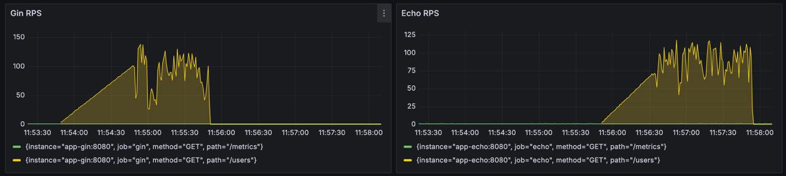

# Eschool

## Краткое описание идеи проекта
Сайт для онлайн образования с возможностью создания собственных учебных программ или курсов.

Предоставить каждому пользователю возможность покупать и проходить курсы различной тематики. 
Также у каждого пользователя должна быть возможность создать собственную школу и образовательную программу 
или присоединиться к уже существующей школе в качестве преподавателя или составителя курса.

По прохождении курса пользователь должен иметь возможность получить сертификат о завершении обучения, 
включающий подробное описание его успеваемости и итоговую оценку.

## Описание предметной области

Предметная область - онлайн образование.

Онлайн обучение - образовательный процесс с применением совокупности телекоммуникационных технологий, 
имеющих целью предоставление возможности обучаемым освоить основной объём требуемой им 
информации без непосредственного контакта обучаемых и преподавателей в ходе процесса обучения.

Школа в данном проекте включает в себя множество преподавателей, студентов и курсов, которые могут быть реализованы
преподавателями данной школы. Также школа содержит дополнительную информацию о создателе, платежные данные
для оплаты того или иного курса и т. д.

Онлайн школа предоставляет возможность получать как теоретические знания, так и практические. 
Каждый курс разбит на уроки, которые могут быть нескольких типов: текстовые, видео-уроки и практические.
Текстовые и видео уроки предоставляют теоретические знания, в то время как практические задания 
представлены в виде тестов с множественным выбором. За прохождение какого-либо урока, студенту начисляются 
баллы за прохождение курса.

## Актуальность

Онлайн образовательные платформы для создания курсов являются актуальными, 
предоставляя современным обучающимся возможность получить качественное образование, 
а преподавателям – эффективный инструмент для создания и распространения образовательного контента.

Онлайн обучение позволяет избежать затрат на поездки, проживание и другие расходы, связанные 
с традиционными формами образования. Это делает обучение более доступным и экономически эффективным.
Онлайн платформы позволяют преодолеть географические и социальные барьеры, 
предоставляя возможность обучаться из любой точки мира.

## Описание ролей
**Гость** - неавторизованный пользователь, который может посматривать информацию о курсе, 
авторизоваться, зарегистрироваться

**Студент** - авторизованный, может посмотреть курсы, проходить, оплачивать их,
а также стать преподавателем.

**Преподаватель** - авторизованный, может создать собственную школу и курсы в ней, 
а также присоединиться к существующей школе в качестве ментора/преподавателя, имеет отзывы о созданных курсах.

## Use-Case диаграмма


## ER диаграмма


## Сложные сценарии

#### Создание и публикация курса

Теоретические уроки курса будут выполнены в виде Markdown страниц, 
практические уроки в виде набора тестов с множественным выбором.
При этом каждый тест содержит максимальную оценку за его решение.

Курс считается правильно созданным, если:
* имеет хотя бы один теоретический урок (текстовый или видео);
* имеет хотя бы один практический урок, состоящий из хотя бы одного теста;
* уроки курса имеют не нулевую максимальную оценку;
* текстовые уроки содержат не пустой markdown файл;
* видео уроки содержат ссылку на видео;
* дата начала и дата окончания курса отличаются хотя бы на 1 день;

Процесс создания и публикации курса:
1. Преподаватель формирует контент курса и соответствующие уроки;
2. Курс находится в состоянии черновика;
3. По завершении работы, курс проверяется на корректность по выше описанным правилам;
4. В случае успешной валидации курс переходит в состояние готовности к публикации;
5. При запросе преподавателя на публикацию становится видимым другим пользователям и переходит в состояние "опубликован".

#### Аутентификация пользователей при входе
1. Пользователь вводит логин и пароль;
2. Проводится идентификация пользователя по переданным данным;
3. Создается пара JWT токенов - access токен и refresh токен;
4. Создается новая сессия;
5. Сессия помещается в хранилище сессий;
6. Пользователю возвращается access и refresh токены.

## Пользовательские сценарии

**Гость** может:
- просматривать информацию о курсах;
- пройти аутентификацию (ввести логин и пароль учетной записи);
- зарегистрироваться.

После авторизации гость становится студентом, то есть авторизованным пользователем системы.

**Студент** может:
- просматривать информацию о курсах;
- покупать курсы;
- проходить курсы;
- стать преподавателем в существующей школе или основать свою школу;

После заявки на становление преподавателем.

**Преподаватель** может:
- составить свой курс;
- редактировать/модерировать существующий курс;

## BPMN-диаграмма


## Диаграмма БД


## Описание технологического стека
- Язык - Golang
- Тип UI - Web SPA (фреймворк React с TypeScript)
- Тип приложения - Web API
- База данных - PostreSQL
- Хранилище сессий - Redis
- Объектное хранилище - S3 MinIO
- Платежная система - YooMoney
- Аутентификация - JWT токены

## Верхнеуровневое разбиение на компоненты


## UML диаграммы классов


## Экраны будущего web-приложения


## Нагрузочное тестирование

Запуск тестирования с Apache Benchmark
```bash
ab -k -n 1000 -c 10 -L 'http://localhost/api/v1/courses/'
```

Запуск одного инстанса
```text
Server Software:        nginx
Server Hostname:        localhost
Server Port:            80

Document Path:          /api/v1/courses/
Document Length:        188499 bytes

Concurrency Level:      10
Time taken for tests:   8.422 seconds
Complete requests:      1000
Failed requests:        0
Keep-Alive requests:    0
Total transferred:      188653000 bytes
HTML transferred:       188499000 bytes
Requests per second:    118.74 [#/sec] (mean)
Time per request:       84.219 [ms] (mean)
Time per request:       8.422 [ms] (mean, across all concurrent requests)
Transfer rate:          21875.29 [Kbytes/sec] received

Connection Times (ms)
              min  mean[+/-sd] median   max
Connect:        0    0   0.1      0       2
Processing:    12   84 347.4     45    6149
Waiting:       10   77 347.4     38    6140
Total:         12   84 347.4     45    6149

Percentage of the requests served within a certain time (ms)
  50%     45
  66%     58
  75%     66
  80%     70
  90%     80
  95%     90
  98%    134
  99%   3045
 100%   6149 (longest request)
```

Запуск с двумя дополнительными инстансами
```text
Server Software:        nginx
Server Hostname:        localhost
Server Port:            80

Document Path:          /api/v1/courses/
Document Length:        188499 bytes

Concurrency Level:      10
Time taken for tests:   4.858 seconds
Complete requests:      1000
Failed requests:        0
Keep-Alive requests:    0
Total transferred:      188653000 bytes
HTML transferred:       188499000 bytes
Requests per second:    205.83 [#/sec] (mean)
Time per request:       48.584 [ms] (mean)
Time per request:       4.858 [ms] (mean, across all concurrent requests)
Transfer rate:          37920.47 [Kbytes/sec] received

Connection Times (ms)
              min  mean[+/-sd] median   max
Connect:        0    0   0.4      0      11
Processing:    15   48  24.9     41     302
Waiting:       12   40  20.6     34     142
Total:         15   48  24.9     41     302

Percentage of the requests served within a certain time (ms)
  50%     41
  66%     49
  75%     57
  80%     63
  90%     77
  95%     92
  98%    113
  99%    132
 100%    302 (longest request)
```

## Бенчмарки (Gin / Echo)
Сгенерировать нагрузку на Gin и Echo сервера. Скрипты находятся в директории bench.
```bash
make pandora
```



